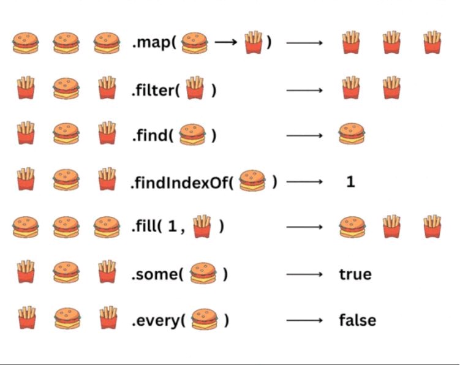

# Extra

- Lancez live-server ou ouvrez le document `extra.html` dans votre navigateur
- Sur la base de l'image ci-dessous (et à l'aide des liens https://youtu.be/Urwzk6ILvPQ et https://developer.mozilla.org/en-US/docs/Web/JavaScript/Reference/Global_Objects/Array#array_methods_and_empty_slots), appliquez les fonctions dans le fichier `extra.js` pour obtenir le résultat escompté :

